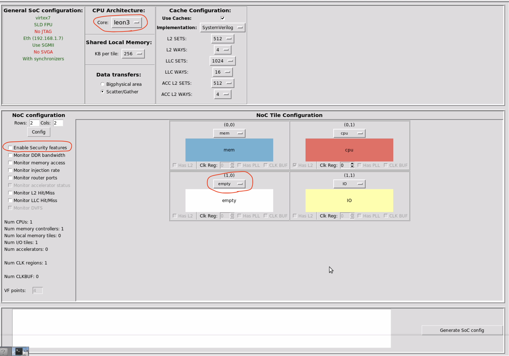
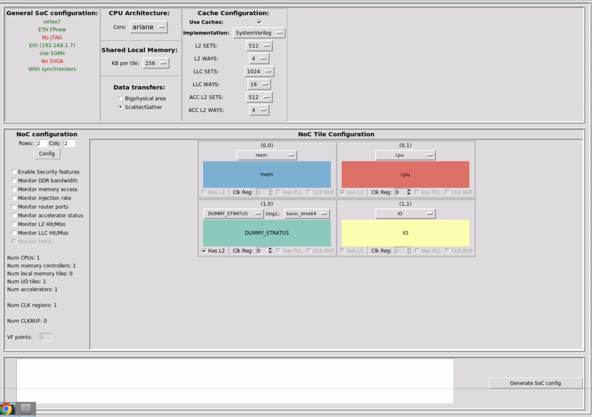
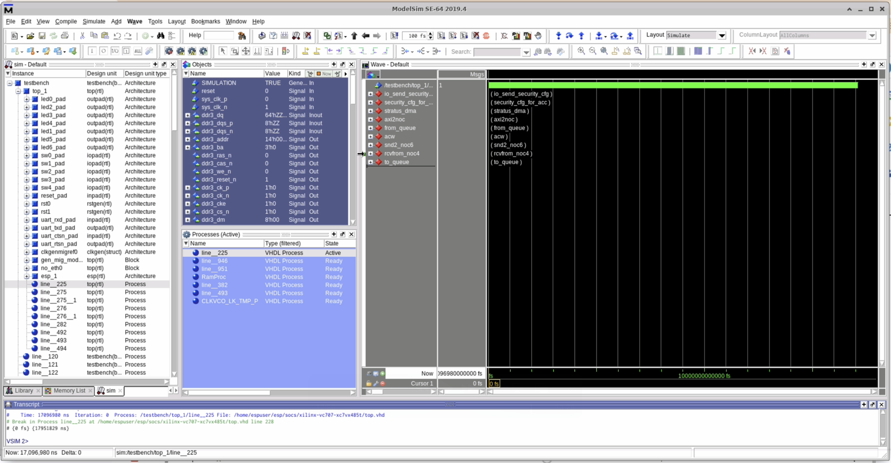

# ESP Bastion

This repository is a minimal example for the paper:

> *A Framework for Secure Third-Party IP Integration in NoC-based SoC Platforms* 

## Repo structure

This project is built on top of the [ESP platform](https://www.esp.cs.columbia.edu). For background and ESP general usage instructions, please refer to the [ESP documentation and tutorials](https://esp.cs.columbia.edu/docs/).

The example is based on [this commit](https://github.com/sld-columbia/esp/tree/607b249f06fb257c50e6f4e2e9d8a447f92eb1ee) of the [ESP repository](https://github.com/sld-columbia/esp). The overall code structure is well documented in the [original ESP README](original_README.md). Bastion maintains the ESP hardware and software structure, with modifications to a few socket modules.

* `rtl/sockets/queues/acc_tile_queue.vhd` This file handles the accelerator tile’s interaction with the NoC. Bastion embeds security mechanisms here to detect and block unauthorized memory transactions initiated by third-party accelerators.

* `rtl/sockets/queues/misc_tile_queue.vhd` This file handles the I/O tile’s interaction with the NoC. The I/O tile is treated as a trusted entity and is responsible for transmitting security configurations to other tiles.

Instead of using a pure RTL testbench, users can simulate the full hardware and firmware stack to approximate a more realistic setup. The top-level firmware also serves the purpose of a testbench.

* `accelerators/stratus_hls/dummy_stratus/sw/baremetal/dummy.c` is the top-level firmware for this experiment. It initializes the accelerator, deliberately modifies the page table to introduce unauthorized memory regions, and instructs the accelerator to access them. After execution, the firmware checks the corresponding memory regions to verify whether the security mechanisms correctly blocked the unauthorized accesses and returned protocol-compliant responses back to the accelerator.

## Tools
* Docker
* ModelSim 2019.4 
* Vivado 2019.2
* Stratus HLS 20.24

Using other versions of Questa or Vivado may require modifying the Makefiles. 

## Steps

### 1. Configure EDA Tools and Start the Docker

* Clone the repo recursively
```bash
git clone --recurse-submodules https://github.com/KastnerRG/ESP-Bastion.git
```

* Edit `./scripts/esp_env_cad.sh` to specify the paths to Vivado, Stratus HLS, and ModelSim/Questa.

* Download the Docker image and launch it with local volumes mounted for both the EDA tools and this repository. This repo should be mounted as a local volume to allow future edits and reuse outside the container.

```bash
docker run -it --security-opt label=type:container_runtime_t --network=host -e DISPLAY=$DISPLAY -v "$HOME/.Xauthority:/root/.Xauthority:rw" -v "/opt:/opt" -v "./ESP-Bastion:/home/espuser/esp" davidegiri/esp-tutorial:asplos2021 /bin/bash
```
* Inside the Docker container, configure the environment variables
```bash
source esp/scripts/esp_env_cad.sh
```

### 2. Generate HLS Accelerator
* This example uses a dummy accelerator written for Stratus HLS. Users are expected to generate the RTL and memory map from the HLS source code located in `accelerators/stratus_hls/dummy_stratus`. 
* A detailed tutorial on generating accelerators using Cadence Stratus HLS and integrating them with the ESP platform is available [here](https://esp.cs.columbia.edu/docs/systemc_acc/).

* After generation, place the accelerator RTL and memory map in the following directories:
```bash
tech/virtex7/acc
tech/virtex7/memgen
```

* Reviewers: If you encounter difficulties accessing or using the Stratus HLS tool, please contact us and we can provide the synthesized RTL files privately.

### 3. Configure SoC architecture

* Enter directory 
```bash
socs/xilinx-vc707-xc7vx485t
``` 
* Launch the SoC configuration GUI
```bash
make esp-xconfig
``` 


* The default SoC configuration is shown in the screenshot above. For this experiment, we use a 2×2 NoC, select **Ariane** as the CPU core, and **Dummy Stratus** as the accelerator. If the user wishes to test the security features, the "Enable Security features" box should be checked. A fully configured SoC should look like the screenshot below.



* Click on `Generate SoC Config` before closing the window.

### 4. Enable/Disable Security Features in Firmware

* Edit line 29 (SECURITY_ON) in `accelerators/stratus_hls/dummy_stratus/sw/baremetal/dummy.c` to match the selected security configuration in the previous step. This ensures the firmware correctly verifies the expected security behavior.

### 5. Run Simulation
* Navigate to the `/home/espuser/esp/socs/xilinx-vc707-xc7vx485t` directory and run the following bash script to launch the simulation with the ModelSim GUI. This will compile both the RTL and firmware, and then start a full SoC simulation.
```bash
source dummy_stratus_sim.sh
```
* We provide a convenient simulation script that organizes key security-related signals into several waveform groups for easier debugging and analysis:
    * Group `io_send_security_cfg` shows the security configuration flits sent from the I/O tile to the accelerator tile, along with relevant protocol signals.
    * Group `security_cfg_for_acc` displays how the security module on the accelerator tile receives and applies the security configuration.
    * Group `stratus_dma` captures AXI signals entering and exiting the accelerator, showing that the security module is transparent to the accelerator.
    * Group `axi2noc` shows the protocol translation between AXI and NoC.
    * Group `acw` shows the key registers and state machine of the security module on the accelerator tile.
    * Groups `from_queue` and `to_queue` show the data interface between the security module and the accelerator tile.
    * Groups `snd2_noc6` and `recvfrom_noc4` capture data exchange between the security module and the NoC, reflecting its interaction with the rest of the SoC.

* Once ModelSim completes initialization, run the following `.tcl` script to start the RTL simulation and display the waveforms of security-related signals.
```bash
source path/to/scripts/sim_op.tcl
```


* The simulator will raise a "Program Completed" failure at the end of the simulation.
    * Around 5295 ns: Security configuration flits transmission.
    * Around 10,196,900 ns to 10,211,700 ns: A set of legal read and write operations.
    * Around 16,557,300 ns to 16,582,600 ns: A set of illegal read and write operations.

* Alternatively, to run ModelSim without the GUI, use the following command. 
```bash
source cmddummy_stratus_sim.sh
```
* To run the simulation without inspecting the waveforms and only verify the end result, simply use this command in ModelSim.
```bash
run -a
```

